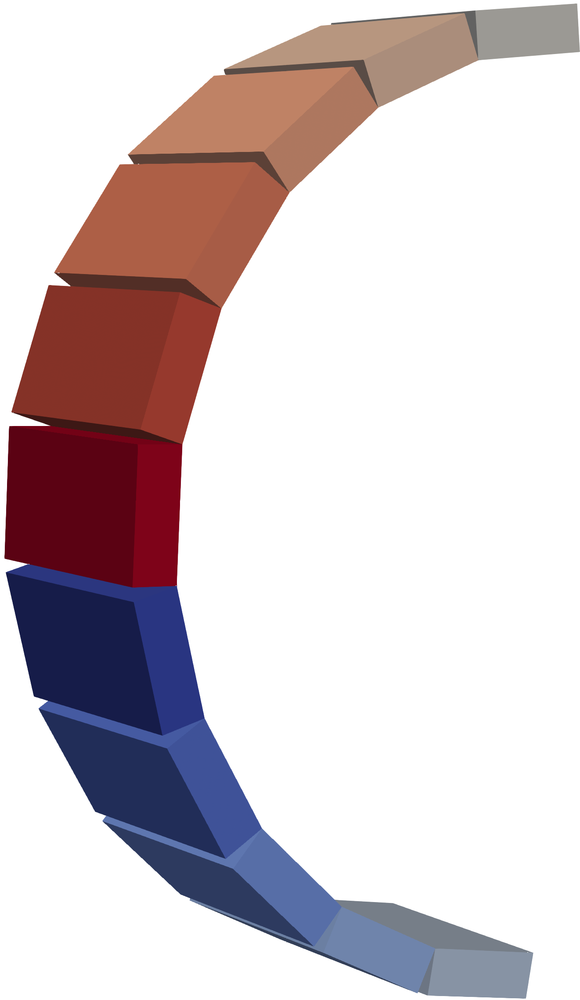

# Magnetic gears

This repository provides utilities to investigate magnetic torque transmission between magnetic gears.

### Major dependencies
* [FEniCS/Dolphin](https://bitbucket.org/fenics-project/dolfin/src/master/)
* [gmsh](https://gmsh.info/)
* [meshio](https://pypi.org/project/meshio)

### Usage
* it is best to check out the [parameter studies](https://github.com/thoeschler/magnetic-gears/tree/main/parameter_study_source)

### Some Images
Magnetic gears with bar magnets (left) and cylinder segment gears (right)

  
  

